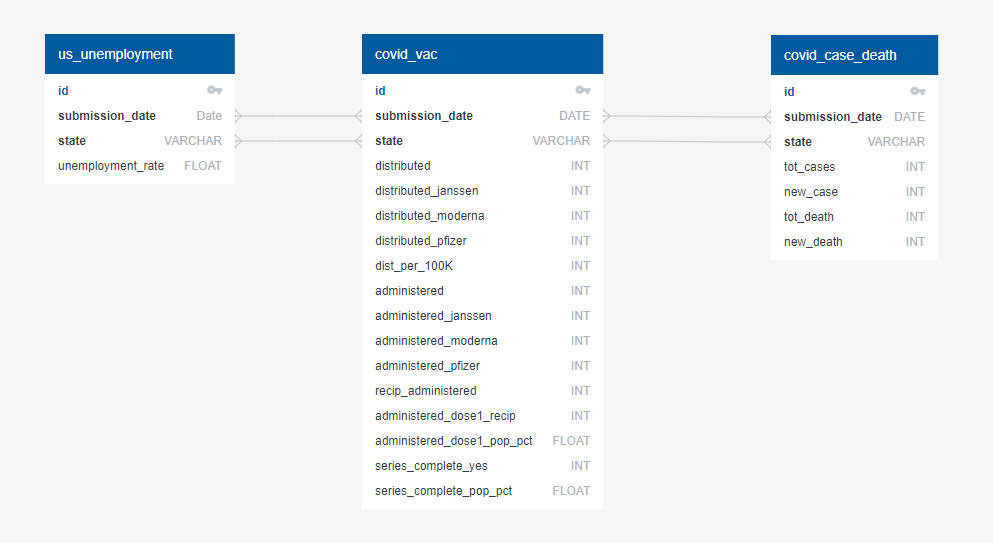

# Covid-19: Unemployment, Vaccines, and Deaths

## Project Proposal

Our team wanted to look at the effects of Covid-19. We looked for datasets on unemployment, vaccines, and deaths all by state.
We wanted to see if life has gotten better over time with people getting vaccinated, be it lower death percentage or lower unemployment rates. All of our data was loaded into a relational database, Postgres.

## Preliminary Findings

We ran a query to see the total percentage of completed vaccination series by state. We found, surprisingly, California only ranked 15th out of all 50 states and Vermont was 1st. We weren't able to find a significant effect on unemployment rates or case to death percentages for California. Unemployment rates remained low in Vermont and seemed unaffected by vaccinations. Vermont did have a 50% decrease in case to death percentages as vaccination percentages increased.

## Future Analysis

Given the time constraints of this project we were only able to run limited analysis on the database.
Future analysis of this database could include:
- State vs State
- Total Cases vs Total Deaths
- Unemployment rates vs Death percentage
- Pfizer Vaccines vs Moderna Vaccines
- Vaccines distributed vs Vaccines administered
- 

## Data

Data accumulated from: 
- The Centers for Disease Control and Prevention
- The Bureau of Labor Statistics
Data population consists of **Unemployment Rates** taken from The Bureau of Labor Statistics, **Covid-19 Vaccinations** and **Covid-19 Cases and Deaths** taken from The Centers for Disease Control and Prevention.

## Extract

We extracted the **Covid-19 Vaccinations** and **Covid-19 Cases and Deaths** from https://data.cdc.gov/  by exporting the datasets as csv files. For the **Unemployment Rates**,  we extracted the data from https://www.bls.gov/ by exporting the dataset as a csv file as well.

## Transform

For the **Covid-19 Vaccinations** after exporting it as a csv file we imported it into our Jupyter Notebook to work on it in Pandas and transformed it by doing the following:
- Selected the columns we wanted to use and created a new dataframe.
- Converted the "Date" column to datetime format.
- Selected Covid-19 data for all 50 states in the U.S.
- Renamed the columns to all lowercase letters.
- Sorted the columns and created the final dataframe.

For the **Covid-19 Cases and Deaths** after exporting it as a csv file we imported it into our Jupyter Notebook to work on it in Pandas and transformed it by doing the following:
- Converted "submission_date" column to datetime format.
- Dropped all data before December 13, 2020.
- Changed the order by the submission date.
- Selected data the 50 states only, and removed any counties or territories.
- Created the final dataframe.

For the **Unemployment Rates** after exporting it as a csv file we imported it into our Jupyter Notebook to work on it in Pandas and transformed it by doing the following:
- Converted "submission_date" column to datetime format.
- Selected the columns that were needed; "submission_date", "Series ID", "Value".
- Renamed "Series ID" column to "state".
- Created a dictionary to rename every Series ID to a state.
- Created the final dataframe.

## Load

A new database was created in Postgres called "Project2" and three tables were added, one for each cleaned dataframe.
The three dataframes were then uploaded from each Jupyter Notebook to their corresponding table. A visualization of our ERD can be seen below.

## Sources

- [COVID-19 Vaccinations in the United States, Jurisdiction](https://data.cdc.gov/Vaccinations/COVID-19-Vaccinations-in-the-United-States-Jurisdi/unsk-b7fc)

- [Unemployment Rates for States](https://www.bls.gov/web/laus/laumstrk.htm)

- [United States COVID-19 Cases and Deaths by State over Time](https://data.cdc.gov/Case-Surveillance/United-States-COVID-19-Cases-and-Deaths-by-State-o/9mfq-cb36/data)
